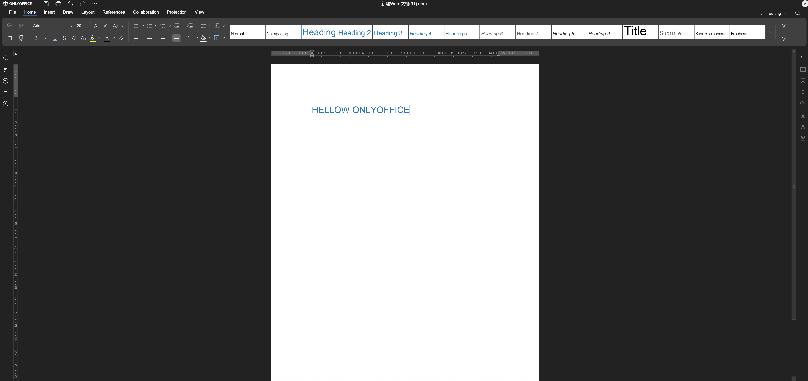
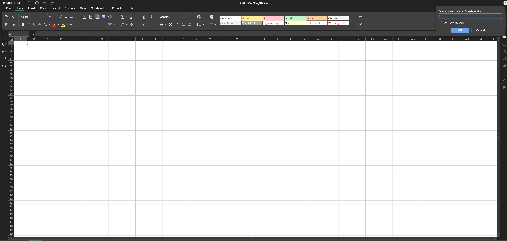
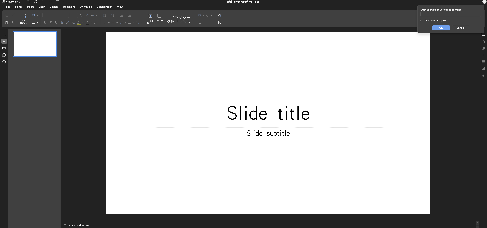
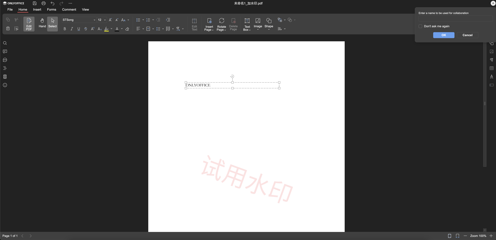

# 📊 ONLYOFFICE Personal

<div align="center">

[](LICENSE)
[](https://github.com/username/OnlyofficePersonal/stargazers)
[](https://github.com/username/OnlyofficePersonal/network)

**基于WebAssembly的本地化ONLYOFFICE办公套件**

🌐 **[Live Demo](https://fernfei.github.io/OnlyofficePersonal/office.html)** - 无需安装，立即体验！

[English](README_EN.md) | 中文

</div>

## 📋 项目介绍

ONLYOFFICE Personal 是一个完全本地化的办公套件解决方案，基于 x2t.wasm 技术实现在浏览器中运行完整的 ONLYOFFICE 功能，无需任何服务器端支持。这意味着您可以在完全离线的环境中处理文档、电子表格和演示文稿，保护您的数据隐私。


## 🌟 核心特性

- **🔒 完全本地化** - 无需服务器，所有数据在本地处理，保护隐私安全
- **⚡ 快速响应** - 基于WebAssembly技术，性能接近原生应用
- **📝 功能完整** - 支持ONLYOFFICE所有办公功能，包括文档编辑、公式计算、动画制作等
- **📋 PDF编辑** - 强大的PDF编辑功能，支持注释、表单填写、文本修改等专业操作
- **🌐 跨平台** - 只要有现代浏览器就能运行，支持Windows、macOS、Linux
- **📂 格式兼容** - 完美支持Microsoft Office格式（.docx、.xlsx、.pptx等）及PDF格式
- **🎨 界面友好** - 熟悉的办公软件界面，学习成本低
- **💾 即开即用** - 无需安装，直接在浏览器中运行

## 🚀 快速开始

### 环境要求
- 现代浏览器（Chrome 80+、Firefox 80+、Safari 14+、Edge 80+）
- Python 3.x（用于本地开发服务器）

### 安装步骤

1. **克隆项目**
   ```bash
   git clone https://github.com/username/OnlyofficePersonal.git
   cd OnlyofficePersonal
   ```

2. **启动本地服务器**
   ```bash
   python -m http.server 8000
   ```
   
3. **访问应用**
   在浏览器中打开 [http://localhost:8000/office.html](http://localhost:8000/office.html)

### 其他启动方式

使用Node.js:
```bash
npx http-server -p 8000
```

使用PHP:
```bash
php -S localhost:8000
```

## 💡 使用示例

### 📄 文档编辑器 (Word)
支持富文本编辑、样式设置、插入图片、表格、图表等功能。



### 📊 电子表格 (Excel)  
提供强大的数据处理能力，支持公式计算、图表生成、数据透视表等。



### 🎯 演示文稿 (PowerPoint)
创建精美的幻灯片，支持动画效果、主题模板、多媒体插入等。



### 📄 PDF编辑器
专业的PDF编辑功能，支持注释、表单填写、文本修改、页面管理等全面的PDF操作。



## 🔧 技术架构

- **前端**: HTML5 + JavaScript + CSS3
- **核心引擎**: ONLYOFFICE Document Server (WebAssembly版本)
- **文件处理**: x2t.wasm (文档转换引擎)
- **兼容性**: 支持主流浏览器的WebAssembly特性

## 📁 项目结构

```
OnlyofficePersonal/
├── vendor/               # 第三方依赖库
│   ├── web-apps/         # 网页应用组件
│   ├── sdkjs/            # JavaScript SDK
│   └── fonts/            # 字体文件
├── assets/               # 静态资源文件
├── docs/                 # 文档和截图
├── office.html           # 主入口文件
├── onlyoffice.html       # onlyoffice入口文件
└── README.md            # 项目说明
```

## 🤝 贡献指南

欢迎提交Issue和Pull Request来改进项目：

1. Fork 本项目
2. 创建特性分支 (`git checkout -b feature/AmazingFeature`)
3. 提交修改 (`git commit -m 'Add some AmazingFeature'`)
4. 推送到分支 (`git push origin feature/AmazingFeature`)
5. 开启Pull Request

## 📄 许可证

本项目基于 AGPL-3.0 许可证开源 - 查看 [LICENSE](LICENSE) 文件了解详情。

## 🙏 致谢

- [ONLYOFFICE](https://www.onlyoffice.com/) - 提供优秀的办公套件解决方案
- [WebAssembly](https://webassembly.org/) - 使浏览器中运行高性能应用成为可能

## 📞 联系方式

如果您有任何问题或建议，欢迎联系我：


---

<div align="center">

**⭐ 如果这个项目对您有帮助，请给它一个星标！**

</div>